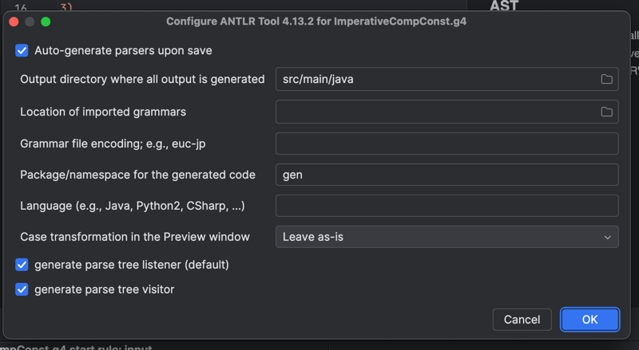

## Imperative compiler JVM

### Install dependencies from maven (only for IntelliJ IDEA)
1) Go to pom.xml
2) In right top corner click sync button
3) This will download dependencies
4) Install https://plugins.jetbrains.com/plugin/7358-antlr-v4

### Run
1) To run test cases launch src/main/java/org/example/Main.java
2) Results will be printed in console

### AST
1) After ANTLR plugin installation right-click on src/main/antlr4/ImperativeCompConst.g4
2) Select "Configure ANTLR" and enter such settings: 
3) Repeat step 1, but select "Generate ANTLR Recognizer" this time
4) In left bottom corner click "ANTLR Preview" and enter some code
5) Select "Parse tree" ang go through it